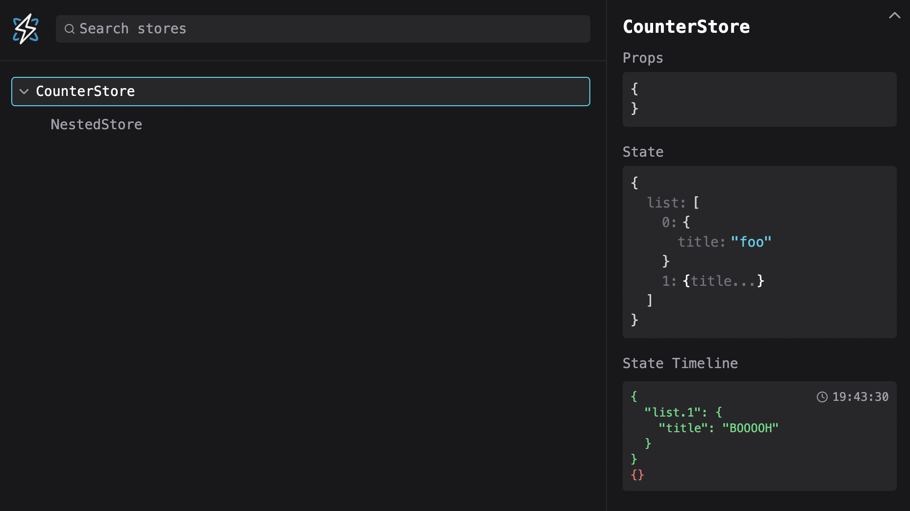

<HomeContent>

<br />

<h1 align="center">

:warning: In BETA :warning:

<iframe class="youtube-video" src="https://www.youtube.com/embed/r3r-i9A72-s?si=1eceGkJvtETCLG0O" title="YouTube video player" frameborder="0" allow="accelerometer; autoplay; clipboard-write; encrypted-media; gyroscope; picture-in-picture; web-share" referrerpolicy="strict-origin-when-cross-origin" allowfullscreen></iframe>

</h1>

## Presenting Impact

> **Impact** is born from the experience of building rich complex productivity applications. Their complexity is not primarily in data fetching, but managing a dynamic and highly interactive user interface on the client. Reactive primitives has helped us solve performance challenges while keeping us sane expressing all this complexity. At the same time these reactive primitives have forced us out of React and into a global scope. With **Impact** you can use the reactive primitives you know and love and replace the reconciling state management in React with intuitive and performant primitives.

:popcorn: [**Watch the streams**](https://www.youtube.com/watch?v=QOkulQKkwN8&list=PLvEC9UhRenelvk-yQ8CQdbBHN_DEFC8to) :popcorn:

If you have used Impact in an application or you think it has valuable perspectives or concepts for a discussion, please use the [Template Slides Deck](https://docs.google.com/presentation/d/1pHBW-HxkugtK8Ny1ebj3a_klqu3HzHnSPvbVNw1drnU/edit?usp=sharing). Present Impact at your company, a local meetup or at a conference. Please reach out if you have any questions or want to suggest changes to the slide deck.

## Choose your reactive flavour

- **@impact-react/signals**: [Documentation](./signal) - [Get started template](https://codesandbox.io/p/devbox/impact-signals-6h3gtk)
- **@impact-react/mobx**: [Documentation](https://mobx.js.org/README.html) - [Get started template](https://codesandbox.io/p/devbox/impact-mobx-tzdy8n)
- **@impact-react/preact**: [Documentation](https://preact.com/guide/v10/signals/) - [Get started template](https://codesandbox.io/p/devbox/impact-preact-rpzzk3)
- **@impact-react/legend**: [Documentation](https://legendapp.com/open-source/state/v3/) - [Get started template](https://codesandbox.io/p/devbox/impact-legend-krrvjk)

::: code-group

```sh [signals]
npm install @impact-react/signals

# Opt-in babel plugin
{
  "plugins": [require("@impact-react/signals/babel-plugin")()]
}

# Opt-in swc plugin
{
  "plugins": [require("@impact-react/signals/swc-plugin")()]
}
```

```sh [mobx]
# Install
npm install @impact-react/mobx

# Opt-in babel plugin
{
  "plugins": [require("@impact-react/mobx/babel-plugin")()]
}

# Opt-in swc plugin
{
  "plugins": [require("@impact-react/mobx/swc-plugin")()]
}
```

```sh [preact]
# Install
npm install @impact-react/preact

# Opt-in babel plugin
{
  "plugins": [require("@impact-react/preact/babel-plugin")()]
}

# Opt-in swc plugin
{
  "plugins": [require("@impact-react/preact/swc-plugin")()]
}
```

```sh [legend]
# Install
npm install @impact-react/legend

# Opt-in babel plugin
{
  "plugins": [require("@impact-react/legend/babel-plugin")()]
}

# Opt-in swc plugin
{
  "plugins": [require("@impact-react/legend/swc-plugin")()]
}
```

:::

::: info

Choosing a plugin makes all components consuming a store to automatically observe. That means you do not need to add any `observer` higher order component. The only requirement is that your store hooks starts with `use` and ends with `Store`, for example `useAppStore` or `useGlobalStore`.

You can combine it with fine grained reactivity inside components if you need that.
:::

## Chrome Extension

See active stores and state changes: [Go to Chrome Store](https://chromewebstore.google.com/detail/impact-debugger/ppaccbkhggblkiidlfjcplopflkjbbal)



</HomeContent>
